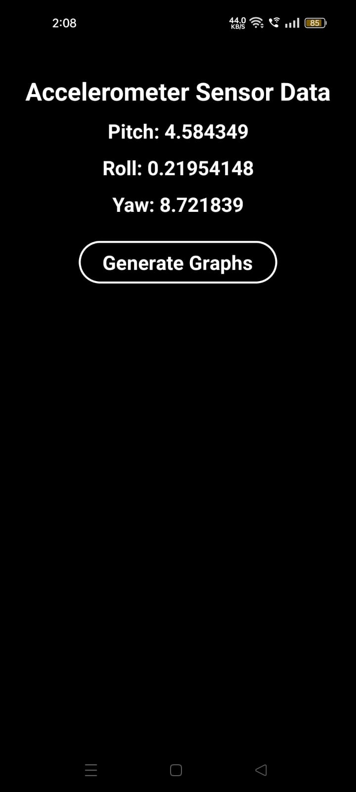
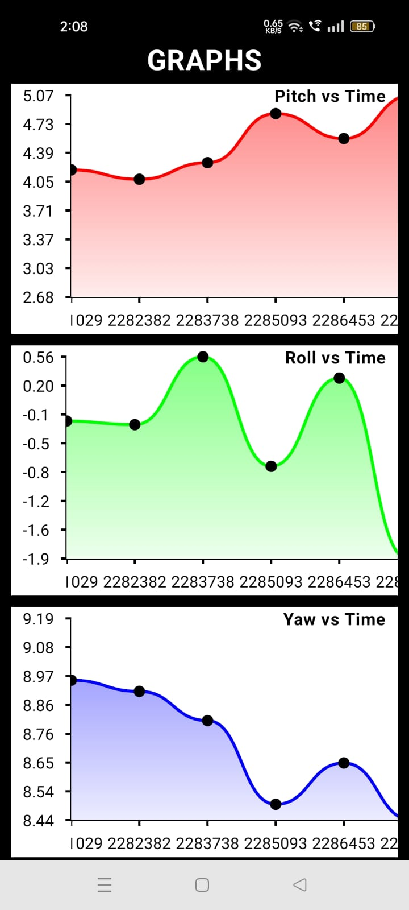

## Smartphone Orientation Tracking and Prediction

This App collects real-time data from the accelerometers of a smartphone to determine its orientation in terms of three angles: pitch, roll, and yaw. Additionally, it stores this orientation data in a local database every second and provides a graphical representation of the historical orientation over time. Furthermore, we can export the data from database and utilize a Python script to predict the next 10 seconds of orientation values using the auto ARIMA model based on the historical data.

### Implementation & Features:

A1. **Real-time Orientation Tracking:**
   - The app collects data from the accelerometers to determine the orientation of the smartphone in terms of three angles: roll, pitch, and yaw.
   - Users can view the orientation of their smartphone in real-time on the app interface.

A2. **Data Logging and Visualization:**
   - The app records orientation data over time at 1-second intervals and stores it in a room database.
   - Users can view the history of orientation data through three graphs: one for each angle (roll, pitch, and yaw).
   - App uses YCharts graphs visualization library.

B1. **Prediction Model:**
   - We export the historical orientation data from database as a CSV file.
   - We uses a Python script to load this CSV file and use an auto ARIMA model to predict the next 10 seconds of orientation values.
   - The predicted values are plotted against the actual values to visualize the accuracy of the prediction.
   - We repeat the same process for three different sensing time intervals such as 100 ms, 500 ms, 1000 ms.

## Screenshots
 
