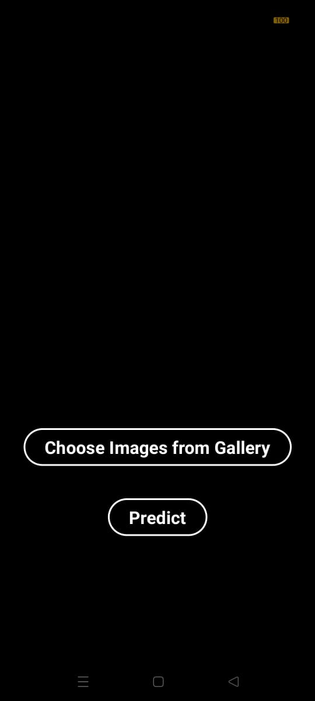
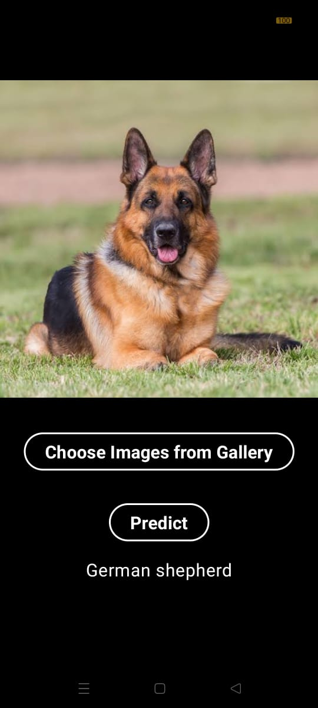

# Image Classification in Android App

This App demonstrates how to run a convolutional neural network (CNN) on Android to classify images using TensorFlow Lite (TFLite) and native C++ for image preprocessing.

## Implementation Details
   - This App uses TensorFlow lite pretrained model to classify images.
   - Images will be loaded from user's gallery with the help of Intent in jetpack compose.
   - User is allowed to select any type and any size of image he want to classify.
   - Before passing image to the model we preprocessed it to make it equal to the predefined input size of model.
   - To make image dimensions appropriate to model we preprocess it using native cpp, which is relatively fater than the image processing in kotlin.

## Screenshots
 
